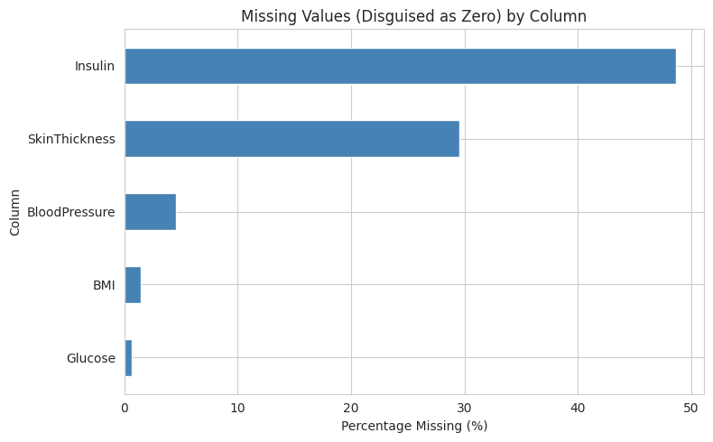
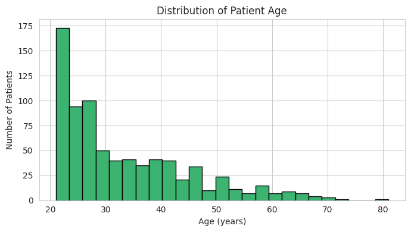
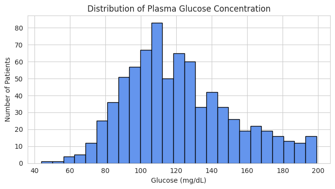
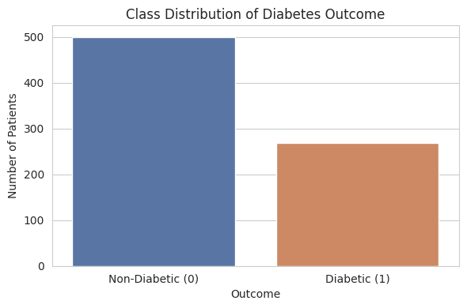
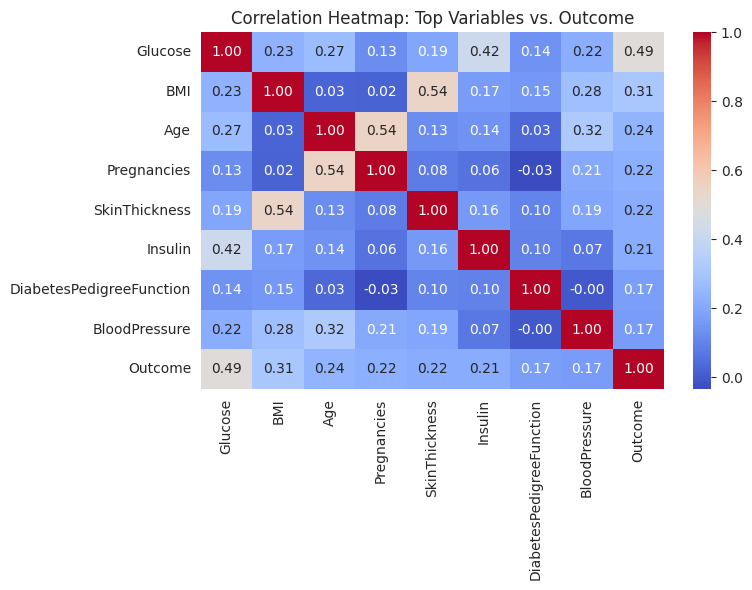
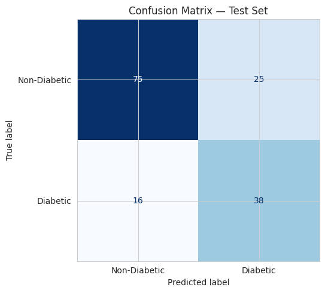
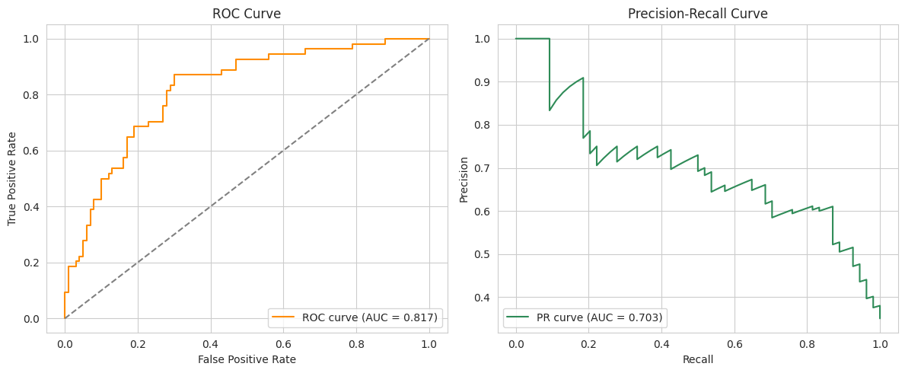
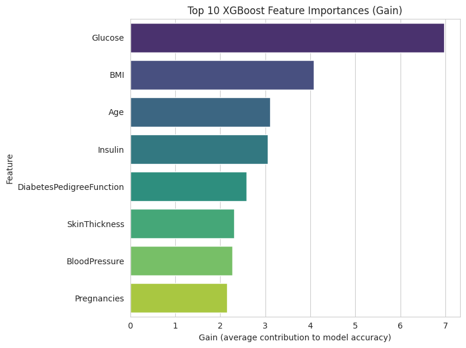

# Diabetes Risk Prediction using XGBoost

An end-to-end supervised binary classification project that predicts whether a patient has diabetes (`1`) or not (`0`) from eight routine diagnostic measurements — pregnancies, glucose, blood pressure, skin thickness, insulin, BMI, diabetes pedigree function, and age — using a gradient-boosted tree model (XGBoost) with SMOTE for class-imbalance correction.

> **Course project — Artificial Intelligence for Healthcare, Post-Lab Submission.**
> Educational exercise only. **Not** a validated diagnostic tool. See [Limitations](#limitations--responsible-use).

---

## Table of Contents

1. [Overview](#overview)
2. [Repository Structure](#repository-structure)
3. [Dataset](#dataset)
   - [Source](#source)
   - [Data Dictionary](#data-dictionary)
   - [Data Quality Checks](#data-quality-checks)
4. [Why This Matters — Diabetes in Pakistan](#why-this-matters--diabetes-in-pakistan)
5. [Methodology](#methodology)
6. [Exploratory Data Analysis](#exploratory-data-analysis)
   - [Missing Values by Column](#1-missing-values-by-column)
   - [Age Distribution](#2-age-distribution)
   - [Glucose Distribution](#3-glucose-distribution)
   - [Target Class Distribution](#4-target-class-distribution)
   - [Correlation Heatmap](#5-correlation-heatmap)
7. [Preprocessing, Train/Test Split & SMOTE](#preprocessing-traintest-split--smote)
8. [Model Configuration](#model-configuration)
9. [Final Model Evaluation](#final-model-evaluation)
   - [Confusion Matrix](#confusion-matrix)
   - [Classification Report](#classification-report)
   - [ROC Curve & Precision-Recall Curve](#roc-curve--precision-recall-curve)
   - [False Positives vs. False Negatives](#false-positives-vs-false-negatives)
10. [Feature Importance](#feature-importance)
11. [Results Summary](#results-summary)
12. [Limitations & Responsible Use](#limitations--responsible-use)
13. [How to Run](#how-to-run)
14. [Tech Stack](#tech-stack)
15. [Attribution](#attribution)

---

## Overview

Diabetes is one of the most pressing chronic-disease burdens worldwide, and — as detailed below — an especially urgent one in Pakistan. This project explores whether a small set of routinely collected clinical variables can be used to classify patient records as diabetic or non-diabetic using a gradient-boosted decision-tree model.

The workflow follows a complete, reproducible ML pipeline:

```
Data Loading → Missing-Value Detection & Imputation → EDA → Stratified Train/Test Split
   → SMOTE (training set only) → XGBoost Training
   → Evaluation Beyond Accuracy (ROC-AUC, PR-AUC, Confusion Matrix)
   → Feature Importance → Leakage/Bias Discussion → Limitations
```

The notebook in this repository (`diabetes_risk_xgboost.ipynb`) is **fully executed** — every table, metric, and figure in this README is taken directly from that run, not fabricated or estimated.

---

## Repository Structure

```
.
├── README.md                          # This file
├── diabetes_risk_xgboost.ipynb        # Fully executed notebook (code + outputs)
├── diabetes.csv                       # Dataset (768 records × 9 columns)
└── images/                            # Exported figures from the notebook
    ├── 01_missing_values_by_column.png
    ├── 02_age_distribution.png
    ├── 03_glucose_distribution.png
    ├── 04_target_class_distribution.png
    ├── 05_correlation_heatmap.png
    ├── 06_confusion_matrix.png
    ├── 07_roc_pr_curves.png
    └── 08_feature_importance.png
```

---

## Dataset

### Source

**Pima Indians Diabetes Database** — Kaggle / UCI Machine Learning Repository, originally collected by the National Institute of Diabetes and Digestive and Kidney Diseases — [kaggle.com/datasets/uciml/pima-indians-diabetes-database](https://www.kaggle.com/datasets/uciml/pima-indians-diabetes-database)

- **Rows:** 768 patient records (all female, of Pima Indian heritage, aged 21+)
- **Columns:** 9 (8 predictors + 1 binary target)
- **Target:** `Outcome` → `1` (diabetic) / `0` (non-diabetic)
- **Missing values (as stored):** 0 — see [Data Quality Checks](#data-quality-checks) for why this is misleading
- **Duplicate rows:** 0

### Data Dictionary

| Column | Description | Type |
|---|---|---|
| `Pregnancies` | Number of times pregnant | Numeric |
| `Glucose` | Plasma glucose concentration (mg/dL, 2-hour oral glucose tolerance test) | Numeric |
| `BloodPressure` | Diastolic blood pressure (mmHg) | Numeric |
| `SkinThickness` | Triceps skinfold thickness (mm) | Numeric |
| `Insulin` | 2-hour serum insulin (mu U/mL) | Numeric |
| `BMI` | Body mass index (kg/m²) | Numeric |
| `DiabetesPedigreeFunction` | A function scoring likelihood of diabetes based on family history | Numeric |
| `Age` | Age in years | Numeric |
| `Outcome` | **Target**: `1` = diabetic, `0` = non-diabetic | Binary |

**Class balance:** 500 non-diabetic (65.1%) vs. 268 diabetic (34.9%) — moderately imbalanced, handled with stratified splitting and SMOTE.

### Data Quality Checks

`.describe()` on the raw data revealed a hidden problem: several columns use **`0` as a disguised missing-value code** rather than `NaN` — a blood pressure, BMI, glucose, insulin, or skin-thickness reading of exactly 0 is not physiologically possible in a living patient. Each affected column was checked and quantified before modeling:

| Column | Missing (zero) count | Missing (%) | Flag |
|---|:---:|:---:|---|
| `Insulin` | 374 | 48.70% | ⚠️ Nearly half the column — imputed with column mean |
| `SkinThickness` | 227 | 29.56% | ⚠️ Substantial — imputed with column mean |
| `BloodPressure` | 35 | 4.56% | Imputed with column mean |
| `BMI` | 11 | 1.43% | Imputed with column mean |
| `Glucose` | 5 | 0.65% | Imputed with column mean |

All five columns were imputed using their own column mean; no columns were dropped, and after imputation the dataset had zero remaining missing values.

---

## Why This Matters — Diabetes in Pakistan

According to the IDF Diabetes Atlas (2024), Pakistan has an age-standardised diabetes prevalence of 31.4% — the highest rate of any country in the world — meaning close to one in every three adults in Pakistan is living with diabetes. Pakistan also ranks fourth globally in the total number of adults with diabetes (approximately 34.5 million), a figure projected to rise substantially by 2050. A large share of these cases are believed to remain undiagnosed, delaying treatment until complications such as cardiovascular disease, kidney failure, or vision loss have already developed.

A lightweight, low-cost screening model built from a handful of routine measurements is directly relevant in this context: it could support early risk-flagging in clinics where full diagnostic laboratory work-ups are not always immediately accessible.

*(Source: International Diabetes Federation, IDF Diabetes Atlas, 11th edition, 2024 Pakistan country data.)*

---

## Methodology

| Stage | Approach |
|---|---|
| Missing-value handling | Zero-as-missing detection in 5 columns → mean imputation |
| Train/test split | 80/20, `random_state=42`, `stratify=y` |
| Class imbalance | SMOTE applied to the **training set only**; test set left untouched to reflect the real, unseen population |
| Preprocessing | No feature scaling — XGBoost is tree-based and scale-invariant |
| Model | `XGBClassifier` — single model, hand-configured with justified hyperparameters (no automated search) |
| Final evaluation | Accuracy, Precision, Recall, F1, Confusion Matrix, ROC curve, ROC-AUC, Precision-Recall curve, PR-AUC |

---

## Exploratory Data Analysis

### 1. Missing Values by Column



**Interpretation:** `Insulin` and `SkinThickness` account for the overwhelming majority of missingness (48.70% and 29.56% respectively), while `BloodPressure`, `BMI`, and `Glucose` are only marginally affected. This informed the decision to impute rather than drop any column — even at ~49% missing, `Insulin` still carries usable signal and dropping it would discard a clinically relevant variable.

### 2. Age Distribution



**Interpretation:** The patient population is right-skewed, concentrated mostly between ages 21 and 40, with a long tail toward older patients. This should be kept in mind when interpreting any age-related pattern — the model has comparatively little data on older patients.

### 3. Glucose Distribution



**Interpretation:** After mean imputation, plasma glucose is roughly centered slightly above 120 mg/dL with a visible spread toward higher values. Glucose correlates with `Outcome` more strongly than any other variable (r = 0.493, see [Correlation Heatmap](#5-correlation-heatmap)), consistent with its established clinical role in diabetes diagnosis.

### 4. Target Class Distribution



**Interpretation:** The dataset is moderately imbalanced — 65.1% non-diabetic vs. 34.9% diabetic. This is not extreme, but it is enough that a trivial "always predict non-diabetic" classifier would already reach ~65% accuracy while catching zero real cases — which is why SMOTE was applied to the training data and why recall, not accuracy alone, is emphasized in evaluation.

### 5. Correlation Heatmap



**Interpretation:** `Glucose` (r = 0.493), `BMI` (r = 0.312), and `Age` (r = 0.238) show the strongest linear association with `Outcome`; `BloodPressure` (r = 0.166) and `DiabetesPedigreeFunction` (r = 0.174) are comparatively weak. These are associative, not causal, relationships in this particular sample.

---

## Preprocessing, Train/Test Split & SMOTE

- **Split:** 80% train (614 records) / 20% test (154 records), stratified on `Outcome` to preserve class ratio in both sets.
  - Training set class counts: `{0: 400, 1: 214}`
  - Test set class counts: `{0: 100, 1: 54}`
- **SMOTE:** Applied to the training set only, after the split — synthetic minority-class (diabetic) examples were generated until the training classes were balanced at `{0: 400, 1: 400}`. The test set was left at its original, real-world imbalance (`{0: 100, 1: 54}`) so evaluation reflects genuine, unseen patient distribution rather than an artificially balanced one.

---

## Model Configuration

A single `XGBClassifier` was trained (no automated hyperparameter search) with the following hand-chosen, justified settings:

| Parameter | Value | Justification |
|---|---|---|
| `max_depth` | 4 | Shallow-to-moderate depth limits overfitting on a small (768-row) dataset |
| `n_estimators` | 200 | Combined with a small learning rate, allows gradual, stable ensemble improvement |
| `learning_rate` | 0.05 | Small step size reduces the risk of overfitting quickly with aggressive trees |
| `subsample` | 0.8 | Random 80% row sampling per tree adds regularization, reducing variance |
| `colsample_bytree` | 0.8 | Random 80% feature sampling per tree, same regularization purpose |
| `eval_metric` | `logloss` | Appropriate probability-sensitive loss for a model later evaluated with ROC-AUC/PR-AUC |
| `random_state` | 42 | Full reproducibility |

Trained on the SMOTE-balanced training set (`X_train_res`, `y_train_res`); evaluated on the untouched, original-distribution test set.

---

## Final Model Evaluation

**Final model:** XGBoost (`max_depth=4`, `n_estimators=200`, `learning_rate=0.05`)
**Training accuracy:** 0.950 | **Test accuracy:** 0.734

### Confusion Matrix



|  | Predicted Non-Diabetic | Predicted Diabetic |
|---|:---:|:---:|
| **Actual Non-Diabetic** | 75 (TN) | 25 (FP) |
| **Actual Diabetic** | 16 (FN) | 38 (TP) |

### Classification Report

| Class | Precision | Recall | F1-score | Support |
|---|:---:|:---:|:---:|:---:|
| Non-Diabetic (0) | 0.82 | 0.75 | 0.79 | 100 |
| Diabetic (1) | 0.60 | 0.70 | 0.65 | 54 |
| **accuracy** | | | **0.73** | 154 |

### ROC Curve & Precision-Recall Curve



- **ROC-AUC = 0.817** — the model ranks a random diabetic patient above a random non-diabetic patient correctly about 81.7% of the time.
- **PR-AUC = 0.703** — reported alongside ROC-AUC because, for an imbalanced positive class, PR-AUC is generally the more informative metric; ROC-AUC can look deceptively strong even when precision on the minority class is comparatively weak.

### False Positives vs. False Negatives

In a diabetes-screening context, a **false negative** (a truly diabetic patient predicted non-diabetic) is the more clinically concerning error — a real, undiagnosed diabetic patient would go unflagged and could miss timely follow-up care. A **false positive** is comparatively less costly, typically leading to a confirmatory test rather than a missed diagnosis.

In this run, the model produced **16 false negatives and 25 false positives** out of 154 test records. The false-negative count is lower than the false-positive count, but 16 missed diabetic patients out of 54 actual diabetic patients (a recall of 0.704) is still a meaningful gap — reinforcing that this model, as-is, is not precise enough for unsupervised clinical screening. Given the asymmetric cost of the two error types, **recall on the positive class is arguably more important than overall accuracy** for this kind of task, and a lower decision threshold than the default 0.5 would likely be more clinically appropriate, at the cost of more false positives.

---

## Feature Importance



| Feature | Importance (gain) |
|---|:---:|
| `Glucose` | 6.980 |
| `BMI` | 4.080 |
| `Age` | 3.117 |
| `Insulin` | 3.055 |
| `DiabetesPedigreeFunction` | 2.584 |
| `SkinThickness` | 2.312 |
| `BloodPressure` | 2.273 |
| `Pregnancies` | 2.153 |

**Interpretation:** `Glucose` is by far the most influential feature, followed by `BMI` and `Age`; the remaining features contribute more evenly. This lines up closely with the EDA correlation ranking. Because `Glucose` is clinically very close to the diagnostic threshold used to define diabetes itself, this ranking should be read with caution — the model is partly learning to reproduce a diagnostic rule rather than discovering fully independent upstream risk factors (see [Limitations](#limitations--responsible-use)). This importance ranking is **model-specific and associative**, not causal evidence about what drives diabetes in general.

---

## Results Summary

| Metric | Value |
|---|:---:|
| Final model | XGBoost (hand-tuned, single configuration) |
| Training Accuracy | 0.950 |
| Test Accuracy | 0.734 |
| Positive-Class Precision | 0.603 |
| Positive-Class Recall | 0.704 |
| Positive-Class F1-score | 0.650 |
| ROC-AUC | 0.817 |
| PR-AUC | 0.703 |
| False Negatives (test set) | 16 |
| False Positives (test set) | 25 |
| Most important feature | `Glucose` |

---

## Limitations & Responsible Use

1. **Possible leakage.** `Glucose` is itself extremely close to the standard clinical diagnostic threshold for diabetes (fasting plasma glucose ≥ 126 mg/dL), meaning the model partly reconstructs the diagnostic rule from a near-diagnostic variable rather than discovering fully independent risk factors.
2. **Narrow population.** The dataset consists exclusively of female patients of Pima Indian heritage, aged 21+. Performance may not generalize to male patients, other ethnicities, younger patients, or — notably, given this project's stated motivation — the Pakistani population, whose genetic background, diet, and body-composition norms differ substantially from the source cohort.
3. **Imputation bias.** Mean imputation for `Insulin` (~49% missing) and `SkinThickness` (~30% missing) is simple and reproducible, but can understate real clinical variability and may bias the model toward the "average" observed patient.
4. **Small sample size.** With 768 total records (268 diabetic before SMOTE), the dataset is modest by machine-learning standards; single-split test metrics may not be fully stable estimates of generalization.
5. **Threshold asymmetry not addressed.** The default 0.5 probability threshold treats false negatives and false positives as equally costly, even though missing a real diabetic patient is typically far more clinically costly than a false alarm.
6. **No fairness, calibration, or subgroup robustness analysis was performed.**
7. **This is an educational project, not a diagnostic system.** Model calibration, prospective validation, deployment monitoring, and regulatory review are entirely outside its scope. **This model must never be used to diagnose, exclude, or treat a real patient.**

---

## How to Run

```bash
git clone <this-repo-url>
cd <this-repo>
pip install pandas numpy matplotlib seaborn scikit-learn imbalanced-learn xgboost jupyter
jupyter notebook diabetes_risk_xgboost.ipynb
```

The notebook loads `diabetes.csv` from the same directory.

---

## Tech Stack

- **Language:** Python 3
- **Data handling:** pandas, numpy
- **Visualization:** matplotlib, seaborn
- **Imbalance correction:** imbalanced-learn (`SMOTE`)
- **Modelling:** XGBoost (`XGBClassifier`)
- **Evaluation:** scikit-learn (`classification_report`, `confusion_matrix`, `roc_auc_score`, `roc_curve`, `precision_recall_curve`, `average_precision_score`)
- **Environment:** Jupyter Notebook / Google Colab

---

## Attribution

- **Dataset:** National Institute of Diabetes and Digestive and Kidney Diseases, *Pima Indians Diabetes Database*, distributed via Kaggle/UCI — [kaggle.com/datasets/uciml/pima-indians-diabetes-database](https://www.kaggle.com/datasets/uciml/pima-indians-diabetes-database)
- **Diabetes-in-Pakistan statistics:** International Diabetes Federation, *IDF Diabetes Atlas*, 11th edition (2024)
- **Course context:** Artificial Intelligence for Healthcare, Lab Manual 01 — Post-Lab Submission
